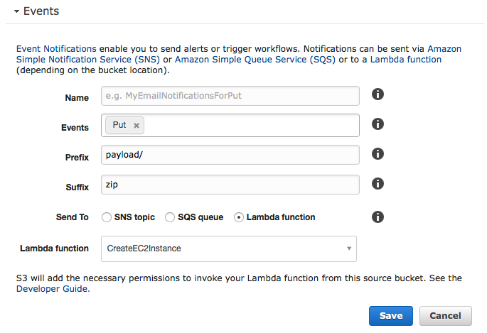

## AWS Lambda deployment

### Step 1
The following
commands will create a new package

    cd <mdbn-repository>
    source tools/env.sh
    cd src
    create_pkg.sh CreateEC2Instance.py ~/mykey.pem
    
where I assumed that `~/mykey.pem` is the private key file associated to the
_mykey_ key pair.

You should terminate the instance by typing `yes` to the last question.

### Step 2

Create a new exectution role as defined in
[Execution Role](http://docs.aws.amazon.com/lambda/latest/dg/with-s3-example-create-iam-role.html)

Create a Custom Policy `PassRole`

`PassRole` is defined as

    {
        "Version": "2012-10-17",
        "Statement": [
            {
                "Sid": "Stmt1489132640000",
                "Effect": "Allow",
                "Action": [
                    "iam:PassRole"
                ],
                "Resource": [
                    "*"
                ]
            }
        ]
    }

This is necessary for the Lambda function to be able to pass
the `aws-mdbn-ec2` role to the new EC2 instance.

Finally create the Lambda function with the command

    create_lambda.sh CreateEC2Instance $S3_BUCKET
    
where `S3_BUCKET` is the AWS S3 bucket name where the runs results will
be stored.

### Step 3

Enable the event on the bucket `S3_BUCKET`.

From the AWS Console select S3 and then click on the name of the
bucket as defined in `S3_BUCKET`.
Then on the top right look for and select "Properties".
Finally expand "Events" and from there configure as follow

### Step 4

Upload the payload

    cd <mdbn-repository>
    source tools/env.sh
    mkdir payload
    cd payload
    init_configs.sh ov ../config/ov_aws_init.csv
    cd ..
    zip -r9 payload.zip payload
    aws s3 cp payload.zip s3://${S3_BUCKET}/payload/payload.zip

Note. For tests you can connect with the command `ssh_to_ec2.sh ~/mykey.pem`.

### Notes

Lambda function deployment package was created as in
[Deployment Package](http://docs.aws.amazon.com/lambda/latest/dg/with-s3-example-deployment-pkg.html)
starting from `src/CreateEC2Instance.py`.
This is all automated in the script `tools/create_pkg.sh`. 